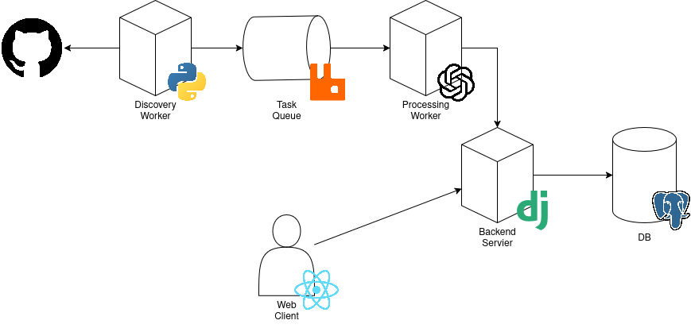

# sigmoid-summer-hackathon-2025-backend | ContributeIT



## Backend API

## Repository Discovery Pipeline

The pipeline consists of the three main modules: `repository parser`, `repository worker` and `openai integration`. 

The parser periodically searches Github repositories (using Github API) to discover open-source projects with pending issues for contribution and pushes the information about every repo to a `rabbitmq` queue.
 
The workers consume the data about repositories sent to the queue, process it using `openai` integration to extract domains used in the filtering and the post them to the database via backend API. 

In order to test this module it is neccessary to run both parser and the worker, the simplest setup is the following:

```
  # from the repo-parsing/broker folder
  python worker.py

  # after that from the repo-parsing folder
  python main.py
```

After the `parser` finishes its execution the `worker` will be waiting for new information about currently featured repositories pushed to the queue.